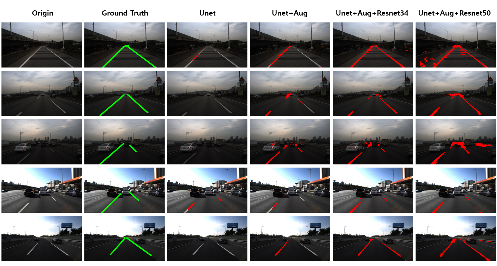

# Edge Autonomous Driving with CARLA

[한국어 README](README.ko.md)

Sim2Real autonomous-driving perception project built around CARLA simulation,
U-Net-based lane segmentation, YOLO object detection, and ONNX/TensorRT edge
inference experiments.

The project explores whether perception models trained on simulated driving
data can be converted, optimized, and evaluated for lower-cost edge deployment.

## Features

- CARLA RGB and semantic camera data collection
- Classical lane perception with IPM, masks, and polynomial fitting
- Binary and multi-class U-Net training pipelines
- ResNet34/ResNet50 segmentation models with `segmentation_models_pytorch`
- YOLO-based vehicle, pedestrian, and traffic-light detection experiments
- Sensor-fusion driving demos with ACC and manual override
- Real-road and AI-Hub dataset conversion scripts
- PyTorch to ONNX export
- ONNX FP16/INT8 and TensorRT FP16/INT8 benchmark scripts
- Inference video rendering utilities

## Project Structure

```text
.
├── src/
│   ├── config.py          # Shared paths, CARLA connection, model paths
│   ├── data/              # Data collection, conversion, augmentation
│   ├── models/            # Dataset classes, model definitions, training
│   ├── driving/           # CARLA driving, lane tracking, sensor fusion
│   ├── optimization/      # ONNX export, ONNX quantization, TensorRT build
│   ├── benchmarks/        # Model benchmarks and video rendering
│   └── utils/             # Environment checks and debugging helpers
├── docs/
│   ├── assets/
│   │   └── benchmark_visualization_4tier.png
│   └── project_summary.md
├── carla_yolo.yaml
├── carla_aug_yolo.yaml
├── LICENSE
├── requirements.txt
└── README.md
```

## Environment

The original experiments used Python 3.10 with CARLA, PyTorch, OpenCV,
Ultralytics YOLO, ONNX Runtime, TensorRT, PyCUDA, and NVIDIA GPU tooling.

The cleanup and benchmark documentation pass was reviewed on the following
local PC environment:

| Component | Specification |
|---|---|
| Host OS | Windows 11 Pro |
| Test OS | Ubuntu 22.04.5 LTS on WSL2 |
| CPU | AMD Ryzen 9 7900X, 12 cores / 24 threads |
| Memory | 31.1 GiB host RAM, 15 GiB visible in WSL2 |
| GPU | NVIDIA GeForce RTX 4080 SUPER, 16,376 MiB VRAM |
| NVIDIA driver / CUDA | Driver 591.86, CUDA 13.1 |
| Python | `conda` environment `carla`, Python 3.10.20 |

```bash
conda activate carla
python --version
```

When PowerShell does not activate the environment correctly, use:

```bash
conda run -n carla python --version
```

## Configuration

Shared project settings are defined in `src/config.py`.

For machine-specific overrides, create `src/local_config.py` and redefine only
the values that need to change. This local override file is ignored by Git.

## Example Workflow

### 1. Collect CARLA Training Data

```bash
python -m src.data.step09_dl_data_collector
python -m src.data.step09_advanced_collector
```

### 2. Prepare and Augment Datasets

```bash
python -m src.data.step20_data_augmentation
python -m src.data.step23_aihub_to_dataset
```

### 3. Train Models

```bash
python -m src.models.step12_train
python -m src.models.step12_advanced_train
```

### 4. Export and Benchmark

```bash
python -m src.benchmarks.step24_benchmark_models
python -m src.optimization.step26_export_onnx
python -m src.optimization.step27_quantize_onnx
python -m src.optimization.step27_build_tensorrt
python -m src.benchmarks.step31_grand_benchmark
```

### 5. Render Inference Videos

```bash
python -m src.benchmarks.step32_make_inference_video
python -m src.benchmarks.step33
```

## Notes

- CARLA scripts require a running CARLA simulator.
- TensorRT scripts require a compatible NVIDIA GPU, CUDA, TensorRT, PyCUDA, and NVML setup.
- `src.utils.inference_combined` is an experimental UFLDv2 integration script and requires external UFLDv2 files that are not included here.
- Dataset samples are not included in the first public release.

## Tests

Unless otherwise noted, the reported benchmark values were measured on the
local PC environment above.

### Benchmark Visualization



### Segmentation Model Benchmark

This benchmark compares baseline, augmented, and ResNet-encoder segmentation
`.pth` models on the converted evaluation dataset.

| Model | Dataset | Encoder | mIoU | Checkpoint Size |
|---|---|---|---:|---:|
| Vanilla U-Net | Original | Custom U-Net | 1.34% | 88.96 MiB |
| Vanilla U-Net | Augmented | Custom U-Net | 13.63% | 88.96 MiB |
| ResNet U-Net | Augmented | ResNet34 | 20.88% | 279.95 MiB |
| ResNet U-Net | Augmented | ResNet50 | 25.79% | 372.69 MiB |

### Quantization Format Benchmark

This benchmark compares exported and quantized ResNet34 models across ONNX
Runtime and TensorRT formats.

| Runtime | Format | FPS | Latency | mIoU | Artifact Size | Change |
|---|---|---:|---:|---:|---:|---|
| ONNX Runtime | FP32 | 29.7 | 33.67 ms | 20.88% | 81.78 MiB | Baseline |
| ONNX Runtime | FP16 | 15.3 | 65.36 ms | 20.88% | 46.89 MiB | FPS -48.5% vs ONNX FP32 |
| ONNX Runtime | INT8 | 34.9 | 28.65 ms | 20.66% | 23.70 MiB | FPS +17.5%, mIoU -0.22pp vs ONNX FP32 |
| TensorRT | FP16 | 155.2 | 6.44 ms | 20.88% | 46.98 MiB | FPS +422.6% vs ONNX FP32 |
| TensorRT | INT8 | 180.2 | 5.55 ms | 20.88% | 23.86 MiB | FPS +16.1%, size -49.2% vs TensorRT FP16 |

### Jetson Nano Benchmark

The Jetson Nano result is limited to one ResNet34 U-Net TensorRT FP16 test from
the presentation materials.

| Device | Model | Runtime | Format | FPS |
|---|---|---|---|---:|
| Yahboom Jetson Nano | ResNet34 U-Net | TensorRT | FP16 | 26.4 |

## License

This project is released under the MIT License. See [LICENSE](LICENSE).

Third-party dependencies and datasets are governed by their own licenses and
terms.
